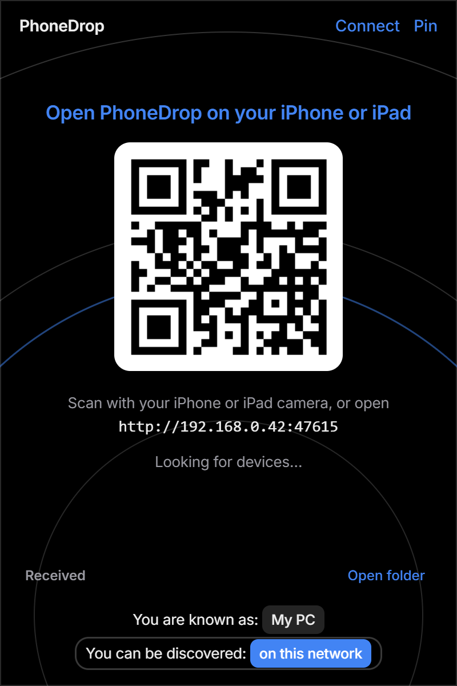
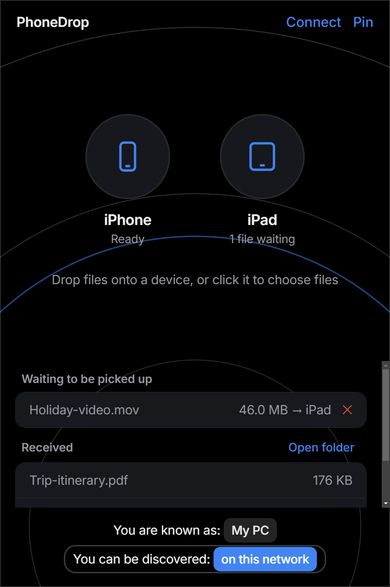

<p align="center">
  
</p>

<p align="center">
  <a href="https://github.com/ImSammyTTV/phonedrop/releases/latest"></a>
  <a href="https://github.com/ImSammyTTV/phonedrop/releases"></a>
  
  <a href="LICENSE"></a>
</p>

<p align="center">
  <b>PhoneDrop</b> is an AirDrop-style file sharing app for your PC. Click the tray icon, scan the QR code with your iPhone or iPad,<br>
  and send photos, videos and files back and forth over your own Wi-Fi.
</p>

<p align="center">
  <a href="https://github.com/ImSammyTTV/phonedrop/releases/latest"><b>⬇️ Download</b></a> ·
  <a href="#-quick-start"><b>🚀 Quick start</b></a> ·
  <a href="#-how-to-use-it"><b>📲 Using it</b></a> ·
  <a href="#-help"><b>❓ Help</b></a> ·
  <a href="#-build-from-source"><b>🛠️ Build</b></a> ·
  <a href="https://github.com/ImSammyTTV/phonedrop/issues/new"><b>🐛 Report a bug</b></a>
</p>

---

## ✨ Features

<table>
<tr>
<td width="50%" valign="top">

### 📲 No app to install
Your **iPhone or iPad** just opens a web page in Safari. Scan the QR code once and you're connected. Nothing to install on the device.

</td>
<td width="50%" valign="top">

### ↔️ Both directions
Send photos and videos **iPhone or iPad → PC** into a folder you choose, or drop files onto a device's bubble to send them **PC → iPhone or iPad**. Connect several devices at once; each gets its own bubble.

</td>
</tr>
<tr>
<td valign="top">

### 🫧 AirDrop-style bubbles
Devices on your network show up automatically as bubbles over softly rippling rings, in a dark look. Drag files onto a bubble or click it to pick files.

</td>
<td valign="top">

### 🖼️ Previews
Received photos get thumbnails, and clicking one opens a large preview. The page on your iPhone or iPad previews what you're about to send too.

</td>
</tr>
<tr>
<td valign="top">

### 🔔 Lives in the tray
Click the tray icon and a small popup appears; click away and it tucks itself back. It never sits in your taskbar. **Pin** keeps it open while you drag files in from Explorer.

</td>
<td valign="top">

### 🚀 Starts with Windows
Runs quietly in the background so it's always ready. Turn that off any time from the tray menu.

</td>
</tr>
</table>

<table>
<tr>
<td width="50%" align="center">
  <br>
  <sub>Scan to connect</sub>
</td>
<td width="50%" align="center">
  <br>
  <sub>Connected: send, receive, preview</sub>
</td>
</tr>
</table>

> [!NOTE]
> **Private by design.** Files go straight from device to device over your own Wi-Fi. There is no cloud, no account and no
> tracking, and PhoneDrop never contacts anything on the internet.

---

## 🚀 Quick start

1. **Download** `PhoneDrop-Setup-…exe` from the [latest release](https://github.com/ImSammyTTV/phonedrop/releases/latest) and run it.
   It installs for your user only, with no admin rights needed.
2. **Allow it through the firewall** if Windows asks (choose *Private networks*). Your iPhone or iPad can't reach the app without this.
3. A small popup opens with a **QR code**. Make sure your iPhone or iPad is on the **same Wi-Fi** as your PC.
4. **Scan the QR code** with your iPhone or iPad camera and open the link in Safari.
5. Your device appears as a bubble on the PC. You're connected!

> [!TIP]
> **SmartScreen** may say *"Windows protected your PC"* because the installer isn't code-signed yet. Click **More info → Run anyway**.
>
> On the iPhone or iPad, tap the **Share** button in Safari and choose **Add to Home Screen** to open PhoneDrop in one tap next time.

---

## 📲 How to use it

| I want to… | Do this |
|---|---|
| **Send photos from my iPhone or iPad to my PC** | Open the PhoneDrop page on the device, tap the **PC bubble**, pick photos or files. They land in `Pictures\PhoneDrop`. |
| **Send a file from my PC to my iPhone or iPad** | Drag it onto that device's **bubble** (or click the bubble to choose files). It appears under *From your PC* on the device's page; tap it to download. |
| **Drag files in from Explorer** | Click **Pin** in the popup first so it stays open, then drag. Click **Unpin** when you're done. |
| **See a received photo** | Click it in the *Received* list for a large preview, with a button to show it in its folder. |
| **Change where files are saved** | Click **Connect**, then **Change save folder**. |
| **Reopen the QR code** | Click **Connect** in the popup. |
| **Turn off start-with-Windows, open the folder or quit** | Right-click the tray icon. |

---

## 🧭 How it works

```text
 iPhone / iPad (Safari)  ⇄  http://<your PC>:47615  ⇄  PhoneDrop (tray app)  →  Pictures\PhoneDrop
```

PhoneDrop runs a tiny web server on your PC (port `47615`). Your iPhone or iPad loads a page from it, uploads files with a plain `PUT`,
and downloads the files you've queued for it. Devices that have the page open are shown as bubbles. That's all there is to it.

---

## ❓ Help

<details>
<summary><b>My iPhone or iPad can't open the page</b></summary>

- Check both devices are on the **same Wi-Fi** (not a guest network, and not mobile data on the phone).
- Allow PhoneDrop through **Windows Firewall** on private networks. If you clicked *Cancel* the first time, open
  *Windows Security → Firewall & network protection → Allow an app through firewall* and tick PhoneDrop.
- Some routers block devices from talking to each other ("AP isolation" or "client isolation"). Turn that off in your router.
- If a VPN is running on the PC, try pausing it.
</details>

<details>
<summary><b>The QR code shows the wrong address</b></summary>

PhoneDrop picks your PC's Wi-Fi address automatically. If you have virtual adapters (VPN, WSL, Hyper-V) it might pick a different
one. Type the address of your Wi-Fi adapter into Safari yourself, followed by `:47615`.
</details>

<details>
<summary><b>My photos are JPEG, not HEIC</b></summary>

That's iOS, not PhoneDrop. Safari can convert photos to JPEG when you pick them. To keep the original HEIC files, in iPhone
*Settings → Photos → Transfer to Mac or PC*, choose **Keep Originals**.
</details>

<details>
<summary><b>HEIC photos have no thumbnail on my PC</b></summary>

Previews come from Windows' own thumbnailer. Install Microsoft's free *HEIF Image Extensions* from the Microsoft Store to preview HEIC.
</details>

<details>
<summary><b>Another program already uses the port</b></summary>

PhoneDrop uses port `47615`. If something else has it, close that program, then quit PhoneDrop from the tray menu and open it again.
</details>

---

## 🛠️ Build from source

You need [Node.js](https://nodejs.org) (v20 or newer).

```bash
git clone https://github.com/ImSammyTTV/phonedrop.git
cd phonedrop
npm install
npm start                  # run it (shows the popup once; add -- --hidden to start in the tray)
bash build-installer.sh    # build dist/PhoneDrop Setup <version>.exe
```

`build-installer.sh` packs the app, stamps the icon with `rcedit`, then wraps it in an NSIS installer. It avoids
`electron-builder`'s code-signing download, which needs symlink privileges on Windows. `node gen-icon.js` regenerates the icon.

| Path | Purpose |
| --- | --- |
| `main.js` | Electron main process: tray, popup window, HTTP server |
| `preload.js` | Bridge between the popup and the main process |
| `renderer/index.html` | The popup on your PC |
| `renderer/phone.html` | The page served to your iPhone or iPad |
| `build-installer.sh` | Builds the Windows installer |

---

## 📄 License

[MIT](LICENSE) © ImSammyTTV. See the [changelog](CHANGELOG.md) for what's new.

